# Hostel96

## Screenshots

- **Landing Page**:
  - 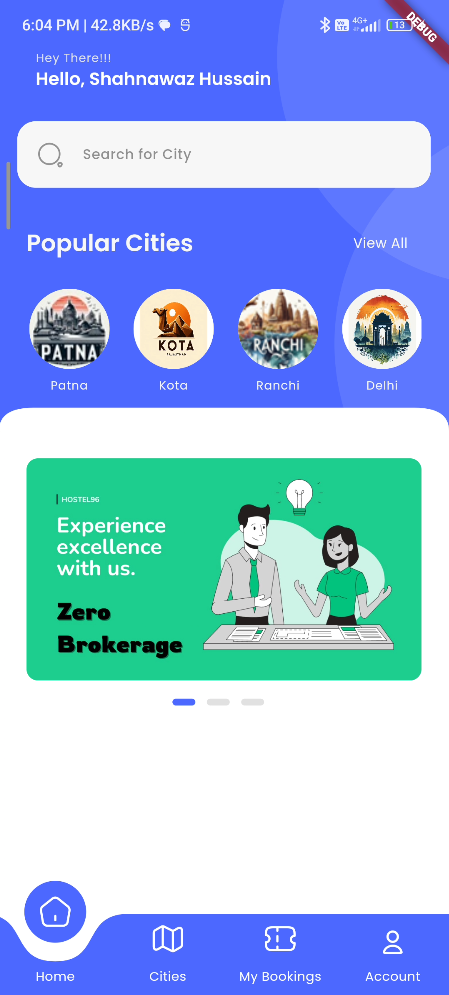

- **Sign Up Page**:
  - 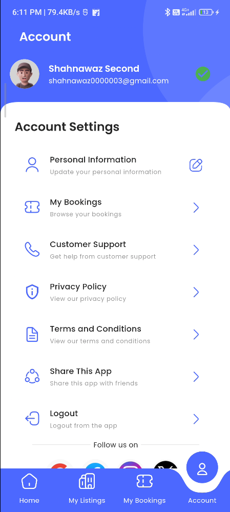

- **Login Page**:
  - 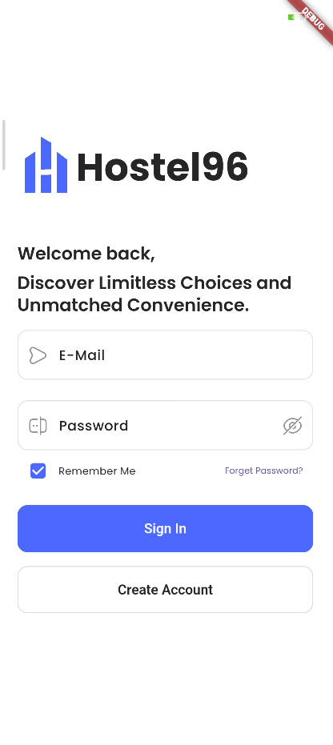

- **Home Dashboard**:
  - 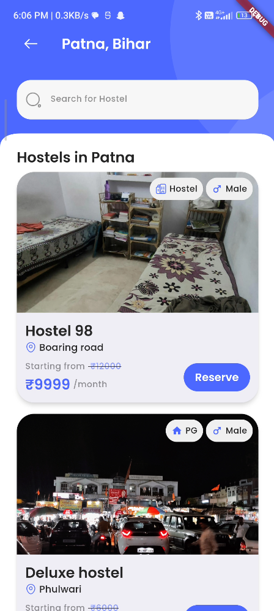

- **All City Page**:
  - 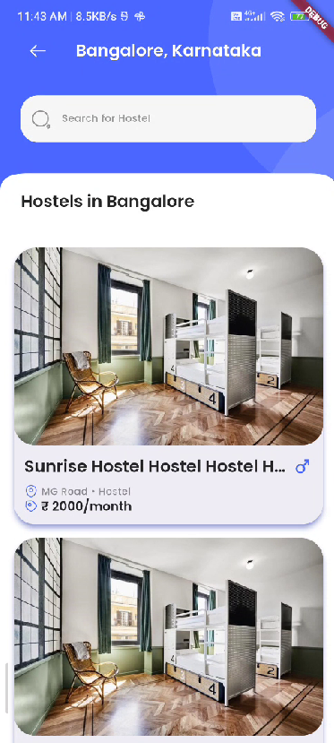

- **List of Hostels**:
  - 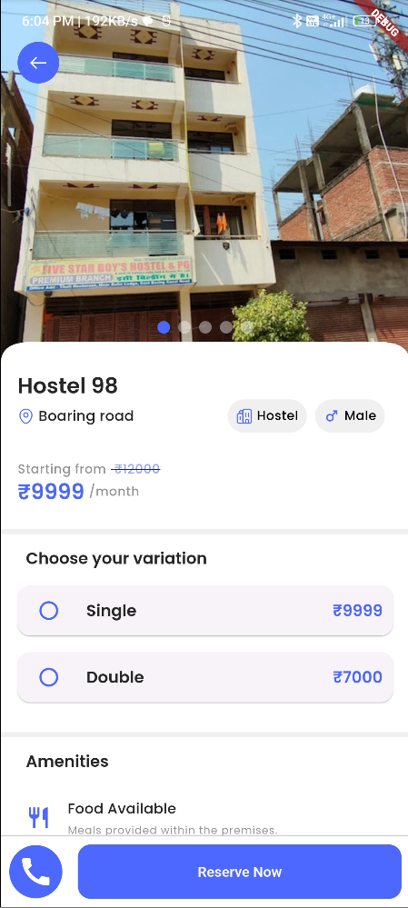

- **Hostel Detail Page**:
  - 

- **Booking Page**:
  - 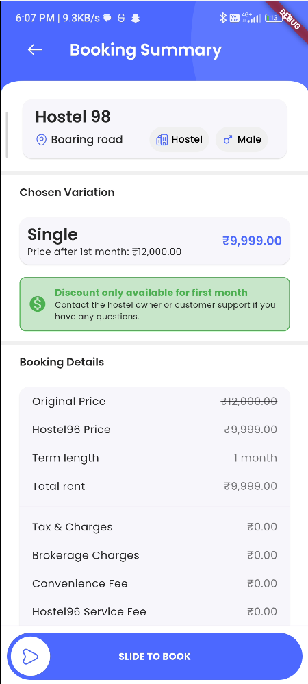

- **User Profile Page**:
  - 

- **My Bookings Page**:
  - 

- **Booking Confirmation Page**:
  - 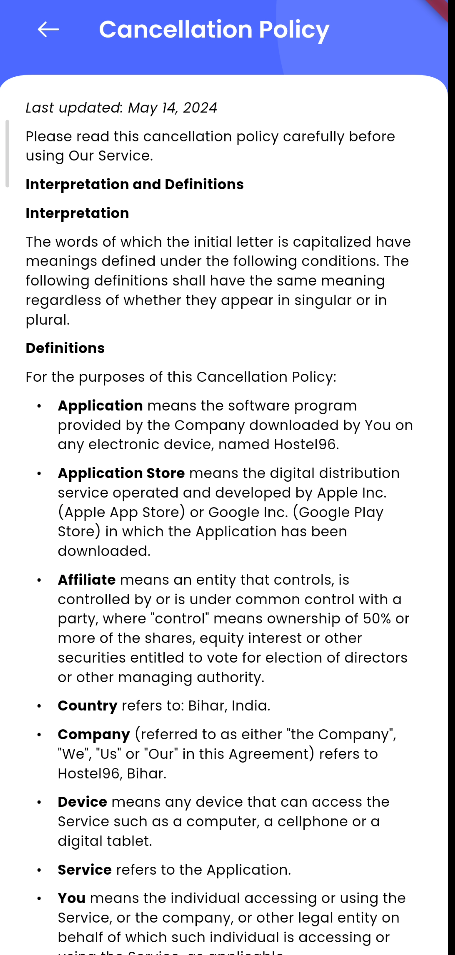

- **Edit Profile Page**:
  - 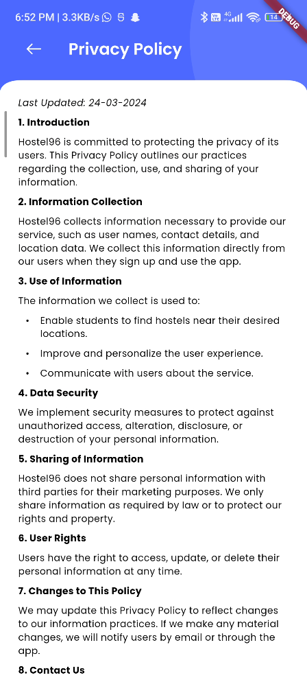

- **App Bar and Navigation Bar**:
  - 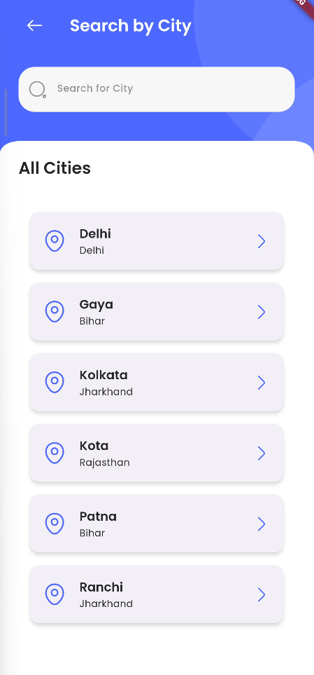

- **Share App Page**:
  - 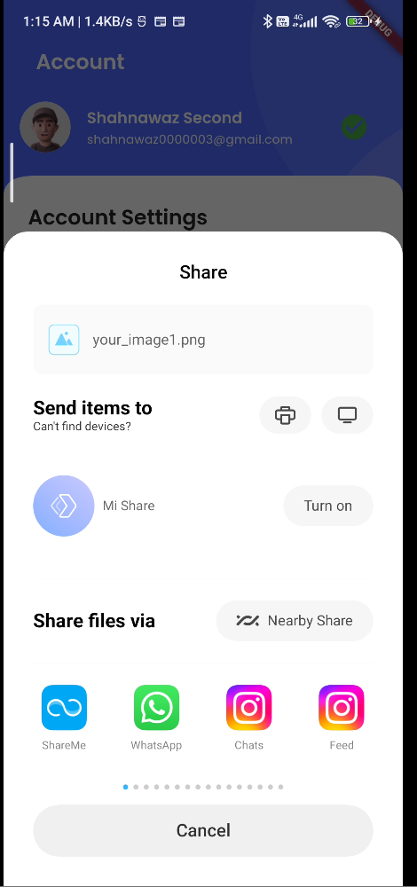

- **Term and Condition**:
  - 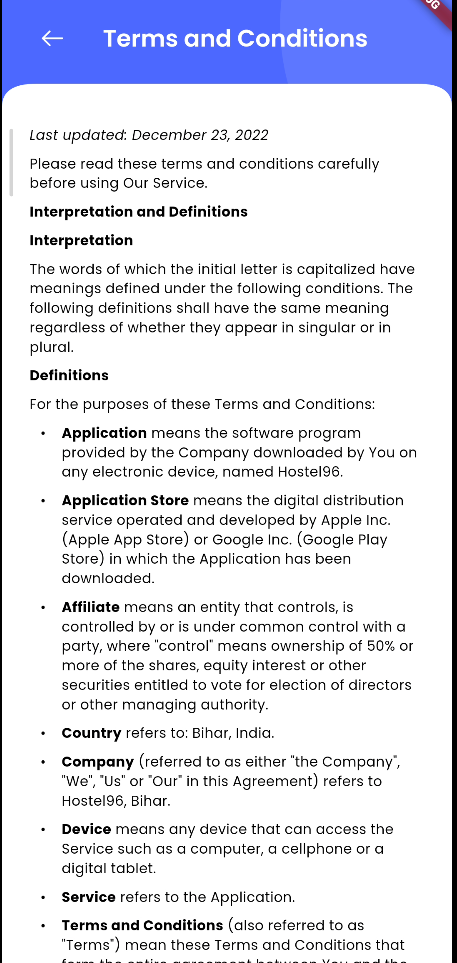

## User Journey and Interface Design

### 1. Initial Access and Authentication

- **Welcome/Onboarding Screens**:
  - Engage users with vibrant, animated screens that illustrate the app's benefits and features.
  - Use appealing visuals and concise text to showcase how users can find the perfect accommodation.

- **Sign Up / Login Page**:
  - **Sign Up Components**:
    - Fields: Email, Password, Name, Phone Number
    - Buttons: "Sign Up"
    - Links: "Login" and "Forgot Password?" for easy navigation.
  - **Login Components**:
    - Fields: Email, Password
    - Buttons: "Login"
    - Options: Social media logins for convenience.
  - **Actions**:
    - Form validation ensures accuracy, with clear error messages for guidance.
    - Successful authentication redirects users to the Home/Dashboard.
  - **Navigation & Access Control**:
    - Users must log in to access app functionalities, ensuring a personalized and secure experience.
    - A splash screen checks the user's authentication status upon app launch.

### 2. Core Functionality and Navigation

- **Home / Dashboard**:
  - **Components**:
    - App Bar: Includes the app logo and profile icon.
    - Search Bar: Allows users to search for city locations.
    - "View All" Button: Leads to a comprehensive city list.
    - Banner Carousel/Grid: Showcases advertisements.
  - **Actions**:
    - Selecting a city or tapping "View All" directs users to a detailed city list or a filtered hostel list.
  - **Navigation**:
    - Bottom Navigation Bar: Facilitates movement across Home, Bookings, and Profile sections with intuitive icons.

- **All City Page**:
  - **Components & Actions**:
    - Search Bar: Located atop a grid of cities, each represented by a unique image icon.
    - City Image: Tapping navigates to the List of Hostels page for that city.

- **List of Hostels Page for Each City**:
  - **Components**:
    - List/Grid Format: Displays hostels with thumbnail, name, price, and rating.
    - Filters: Dynamic filters for price and amenities.
  - **Actions & Navigation**:
    - Selecting a listing navigates to its Detail Page.
    - Filters adjust search results in real-time.

### 3. Detailed Exploration and Interaction

- **Hostel/PG Detail Page**:
  - **Components**:
    - Image Gallery/Carousel: Showcases multiple images.
    - Detailed Information: Provides comprehensive details about the hostel.
    - Buttons: "Book Now" and "Contact Owner" for direct actions.
  - **Actions**:
    - Allows booking and direct owner contact.

- **Booking Page**:
  - **Components**:
    - Booking Form: Includes fields for booking details.
    - Pricing Breakdown: Shows a detailed pricing summary.
    - "Proceed to Payment" Button: Integrates with Razorpay for secure transactions.
  - **Navigation**:
    - Confirmation redirects to the Booking Confirmation Page.
    - Back Button: Returns users to hostel details.

### 4. Personalization and User Support

- **User Profile Page**:
  - **Components**:
    - Sections: Personal info and preferences.
    - Buttons: "Edit Profile" and "Logout" for account management.
  - **Actions**:
    - Allows users to update their information for a tailored experience.

### 5. Enhanced Features and Navigation

- **My Bookings Page**:
  - **Components**:
    - Lists: Displays current and past bookings.
    - Options: Detailed views, modifications, or cancellations.
  - **Actions**:
    - Enhances user control over their bookings with confirmation dialogs for safety.

- **Booking Confirmation Page**:
  - **Components**:
    - Confirmation Message: Shows booking details.
    - Options: View bookings or download confirmation.

- **Edit Profile Page**:
  - **Components**:
    - Pre-filled Form Fields: Makes updates easy.
    - "Save Changes" Button: Confirms modifications.

### 6. Global Elements

- **App Bar & Bottom Navigation Bar**:
  - **Consistency**: Present across most pages for ease of use.
  - **App Bar**: Provides context-specific titles and navigation options.
  - **Bottom Navigation Bar**: Ensures quick access to the app's main areas.
